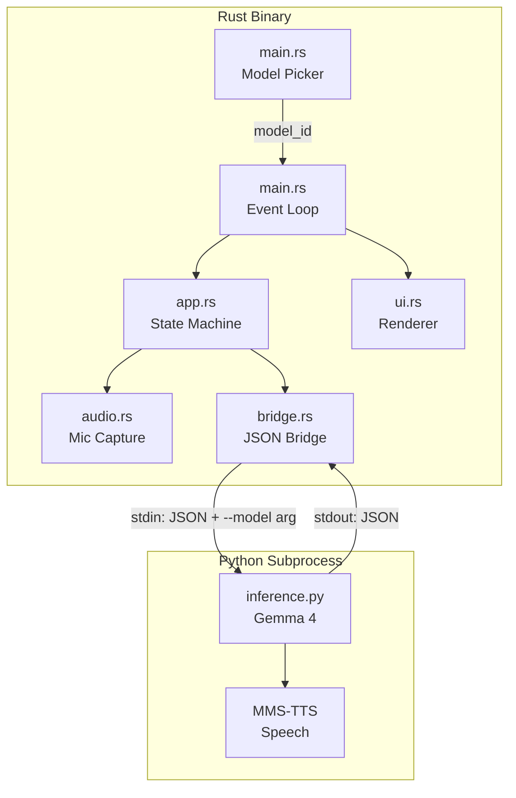
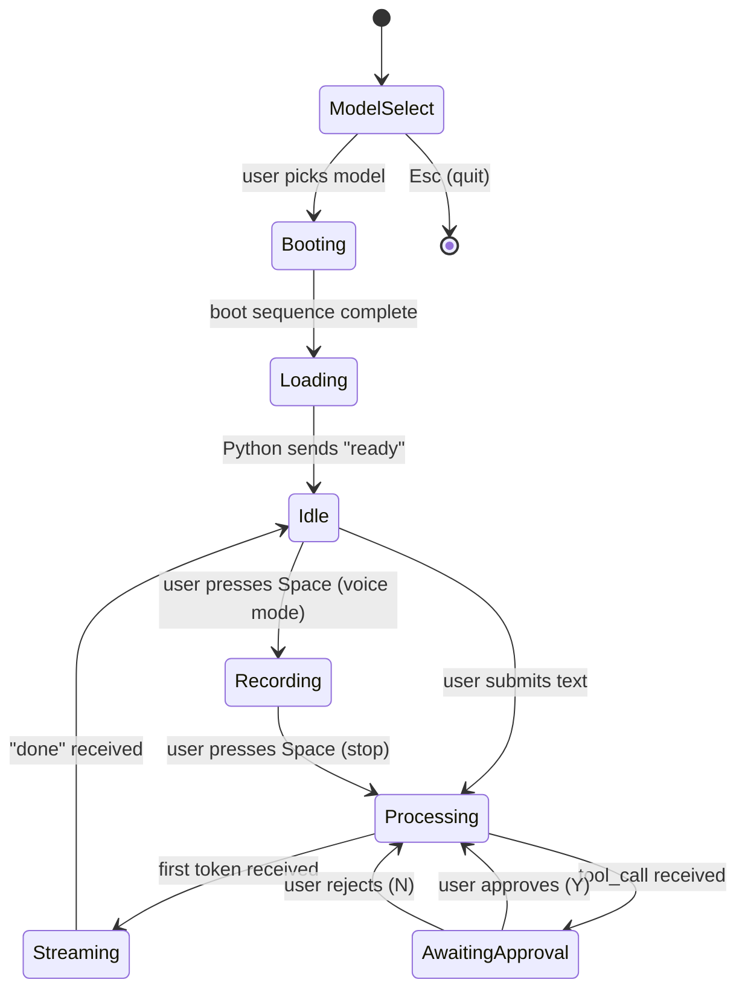

# Architecture

## System Overview

Terminator is a two-process architecture: a Rust binary handles the TUI, audio, and user interaction, while a Python subprocess runs AI inference. They communicate over a JSON-lines protocol via stdin/stdout. At startup, a Ratatui-based model picker lets users choose from 4 Gemma 4 variants.

## Supported Models

| Model | Effective Params | RAM | Disk | Context |
|-------|-----------------|-----|------|---------|
| E2B | ~2.3B | ~4 GB | ~5 GB | 128K |
| E4B | ~4.5B | ~8 GB | ~9 GB | 128K |
| 26B-A4B (MoE) | 26B total, 4B active | ~18 GB | ~16 GB | 256K |
| 31B (Dense) | 31B | ~20 GB | ~20 GB | 256K |

## State Machine

The application is driven by a state machine in `app.rs`:

Note: ModelSelect is handled in `main.rs` before the App state machine starts.

## Bridge Protocol

### Rust → Python (Request)

| Type | Fields | Purpose |
|------|--------|---------|
| `text` | `content` | User typed message |
| `audio` | `data` (base64 PCM) | Voice input |
| `tool_result` | `tool`, `result`, `approved` | Tool execution result |
| `reset` | — | Reset conversation |

### Python → Rust (Response)

| Type | Fields | Purpose |
|------|--------|---------|
| `ready` | — | Model loaded |
| `transcript` | `content` | Audio transcription |
| `token` | `content` | Streaming token |
| `tool_call` | `tool`, `args` | Request tool execution |
| `done` | — | Response complete |
| `error` | `message` | Error occurred |

## Design Patterns

- **Subprocess bridge**: Isolates Python ML runtime from Rust via JSON-lines over stdin/stdout
- **State machine**: All behavior driven by `State` enum transitions
- **Security-by-approval**: Tool calls intercepted and require explicit user Y/N via popup
- **Streaming tokens**: AI responses stream token-by-token for real-time TUI display
- **Model selection**: Ratatui picker at startup with download status detection
- **Fake progress**: Loading bar creeps to 92% then jumps to 100% when model actually ready
