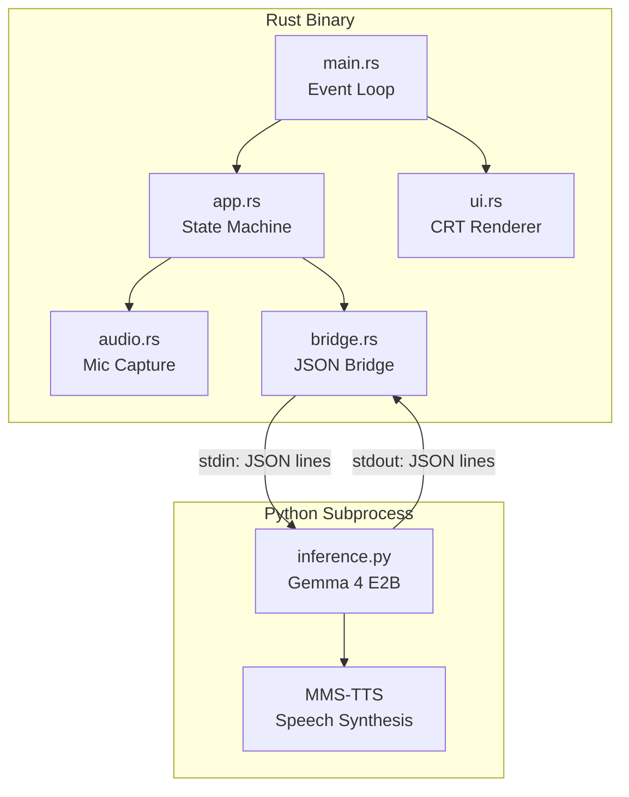
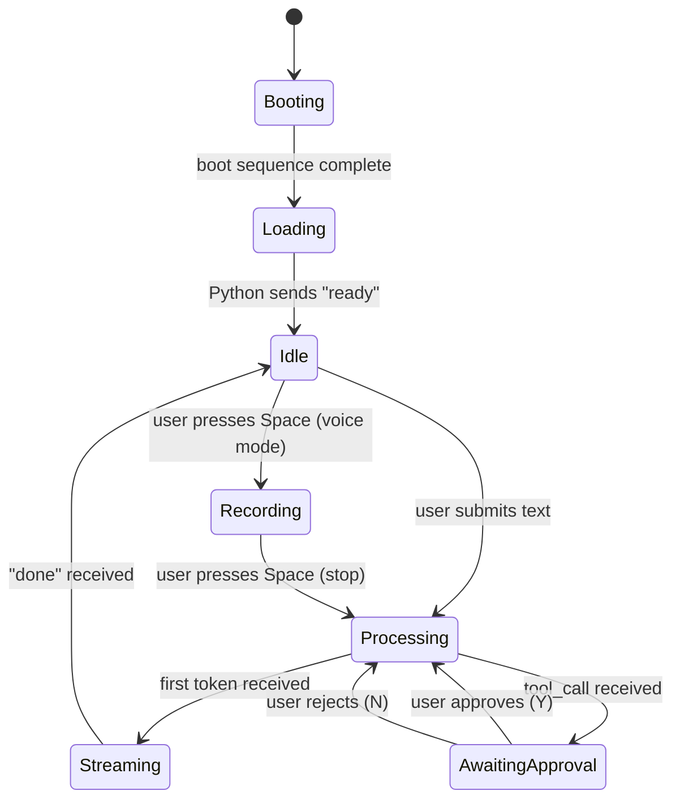

# Architecture

## System Overview

Terminator is a two-process architecture: a Rust binary handles the TUI, audio, and user interaction, while a Python subprocess runs AI inference. They communicate over a JSON-lines protocol via stdin/stdout.

## State Machine

The application is driven by a state machine in `app.rs`:

## Bridge Protocol

The Rust ↔ Python communication uses JSON-lines over stdin/stdout.

### Rust → Python (Request)

| Type | Fields | Purpose |
|------|--------|---------|
| `text` | `content` | User typed message |
| `audio` | `data` (base64 PCM) | Voice input |
| `tool_result` | `tool`, `result`, `approved` | Tool execution result |
| `reset` | — | Reset conversation |

### Python → Rust (Response)

| Type | Fields | Purpose |
|------|--------|---------|
| `ready` | — | Model loaded |
| `transcript` | `content` | Audio transcription |
| `token` | `content` | Streaming token |
| `tool_call` | `tool`, `args` | Request tool execution |
| `done` | — | Response complete |
| `error` | `message` | Error occurred |

## Design Patterns

- **Subprocess bridge**: Isolates Python ML runtime from Rust, communicating via JSON-lines. Enables clean process lifecycle management.
- **State machine**: All UI and logic behavior is driven by `State` enum transitions, making the event loop predictable.
- **Security-by-approval**: Tool calls are intercepted and require explicit user confirmation via a popup before execution.
- **Streaming tokens**: AI responses stream token-by-token for real-time display in the TUI.
