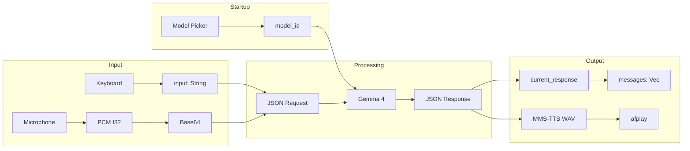

# Data Models

## Rust Data Structures

### State (src/app.rs)
```rust
pub enum State {
    Booting,          // Boot animation playing
    Loading,          // Waiting for Python "ready"
    Idle,             // Accepting user input
    Recording,        // Capturing microphone audio
    Processing,       // Waiting for AI response
    Streaming,        // Receiving streaming tokens
    AwaitingApproval, // Tool call pending user Y/N
}
```

### App (src/app.rs)
```rust
pub struct App {
    pub state: State,
    pub input: String,
    pub messages: Vec<ChatMessage>,
    pub current_response: String,
    pub voice_mode: bool,
    pub boot_step: usize,
    pub loading_pct: u8,        // Fake progress 0-100
    pub should_quit: bool,
    pub status: String,
    pub recording_start: Option<Instant>,
    pub audio_level: AudioLevel,
    pub pending_tool: Option<PendingTool>,
    pub model_id: String,       // Selected model (e.g. "E4B")
    pub bridge: Bridge,
    pub audio: AudioCapture,
}
```

### ModelInfo (src/bridge.rs)
```rust
pub struct ModelInfo {
    pub id: &'static str,    // "E2B", "E4B", "26B-A4B", "31B"
    pub name: &'static str,  // "Gemma 4 E2B"
    pub ram: &'static str,   // "~4 GB"
    pub size: &'static str,  // "~5 GB"
}
```

### ChatMessage, PendingTool, Bridge
```rust
pub struct ChatMessage { pub role: String, pub content: String }
pub struct PendingTool { pub tool: String, pub args: serde_json::Value, pub display: String }
pub struct Bridge { child: Child, stdin: ChildStdin, pub rx: mpsc::Receiver<Response> }
```

## Python Data Structures

### Model Variants (download_model.py)
```python
MODELS = {
    "E2B":     ("google/gemma-4-E2B-it",     "gemma-4-E2B-it",     "~5 GB"),
    "E4B":     ("google/gemma-4-E4B-it",     "gemma-4-E4B-it",     "~9 GB"),
    "26B-A4B": ("google/gemma-4-26B-A4B-it", "gemma-4-26B-A4B-it", "~16 GB"),
    "31B":     ("google/gemma-4-31B-it",     "gemma-4-31B-it",     "~20 GB"),
}
```

### Conversation History
```python
history = [
    {"role": "user", "content": "..."},
    {"role": "assistant", "content": "..."},
    {"role": "user", "content": [{"type": "audio", "audio_url": "..."}]},
]
```

## Data Flow


