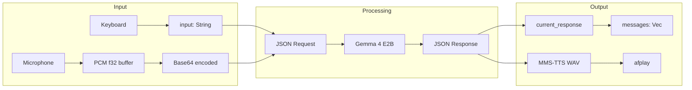

# Data Models

## Rust Data Structures

### State (src/app.rs)
```rust
pub enum State {
    Booting,          // Boot animation playing
    Loading,          // Waiting for Python "ready"
    Idle,             // Accepting user input
    Recording,        // Capturing microphone audio
    Processing,       // Waiting for AI response
    Streaming,        // Receiving streaming tokens
    AwaitingApproval, // Tool call pending user Y/N
}
```

### App (src/app.rs)
```rust
pub struct App {
    pub state: State,
    pub input: String,              // Text input buffer
    pub messages: Vec<ChatMessage>, // Conversation history
    pub current_response: String,   // Streaming response accumulator
    pub voice_mode: bool,
    pub boot_step: usize,
    pub should_quit: bool,
    pub status: String,             // Status bar text
    pub recording_start: Option<Instant>,
    pub audio_level: AudioLevel,    // Arc<Mutex<Vec<f32>>> for waveform
    pub pending_tool: Option<PendingTool>,
    bridge: Bridge,
    audio: AudioCapture,
}
```

### ChatMessage (src/app.rs)
```rust
pub struct ChatMessage {
    pub role: String,    // "user" or "ai"
    pub content: String,
}
```

### PendingTool (src/app.rs)
```rust
pub struct PendingTool {
    pub tool: String,           // Tool name
    pub args: serde_json::Value, // Tool arguments
    pub display: String,         // Human-readable description
}
```

### Bridge (src/bridge.rs)
```rust
pub struct Bridge {
    child: Child,                    // Python subprocess
    stdin: ChildStdin,               // Write requests
    pub rx: mpsc::Receiver<Response>, // Read responses
}
```

## Python Data Structures

### Conversation History
Maintained as a `list[dict]` in `inference.py`:
```python
history = [
    {"role": "user", "content": "..."},
    {"role": "assistant", "content": "..."},
    {"role": "user", "content": [{"type": "audio", "audio_url": "..."}]},
]
```

### Tool Definition Schema
```python
{
    "name": "tool_name",
    "description": "What the tool does",
    "parameters": {
        "type": "object",
        "properties": {
            "param": {"type": "string", "description": "..."}
        },
        "required": ["param"]
    }
}
```

## Data Flow Diagram


