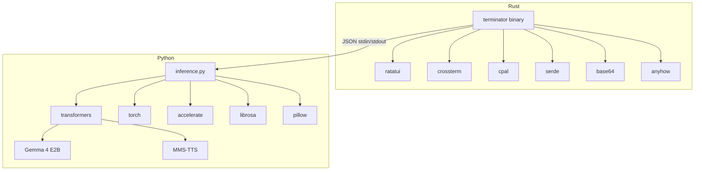

# Dependencies

## Rust Dependencies (Cargo.toml)

| Crate | Version | Purpose |
|-------|---------|---------|
| `ratatui` | 0.29 | Terminal UI framework (widgets, layout, rendering) |
| `crossterm` | 0.28 | Cross-platform terminal manipulation (raw mode, events) |
| `cpal` | 0.15 | Cross-platform audio capture (microphone input) |
| `serde` | 1 (with `derive`) | Serialization/deserialization for JSON protocol |
| `serde_json` | 1 | JSON parsing and generation |
| `base64` | 0.22 | Encoding PCM audio for transport |
| `anyhow` | 1 | Error handling with context |

## Python Dependencies (requirements.txt)

| Package | Version | Purpose |
|---------|---------|---------|
| `transformers` | ≥4.52.0 | HuggingFace model loading and inference |
| `torch` | ≥2.6.0 | PyTorch tensor computation and GPU acceleration |
| `torchvision` | ≥0.20.0 | Image processing for vision encoder |
| `accelerate` | ≥1.6.0 | Model loading optimization |
| `librosa` | ≥0.10.0 | Audio processing and resampling |
| `huggingface_hub` | ≥0.30.0 | Model downloading from HuggingFace |
| `pillow` | ≥10.0.0 | Image loading for vision analysis |
| `soundfile` | ≥0.13.0 | Audio file I/O |

## AI Models

| Model | Source | Size | Role |
|-------|--------|------|------|
| Gemma 4 E2B | `google/gemma-4-E2B-it` | ~5 GB | Text + audio + vision inference |
| MMS-TTS | `facebook/mms-tts-{lang}` | ~145 MB/lang | Speech synthesis (loaded on demand) |

## System Dependencies

| Dependency | Required | Purpose |
|-----------|----------|---------|
| macOS + Apple Silicon | Yes | Metal GPU acceleration, `afplay` for TTS |
| Python 3.11+ | Yes | Inference subprocess |
| Rust 1.75+ | Yes | Build the binary |
| `afplay` | Yes (macOS built-in) | Play TTS WAV output |

## Dependency Diagram

