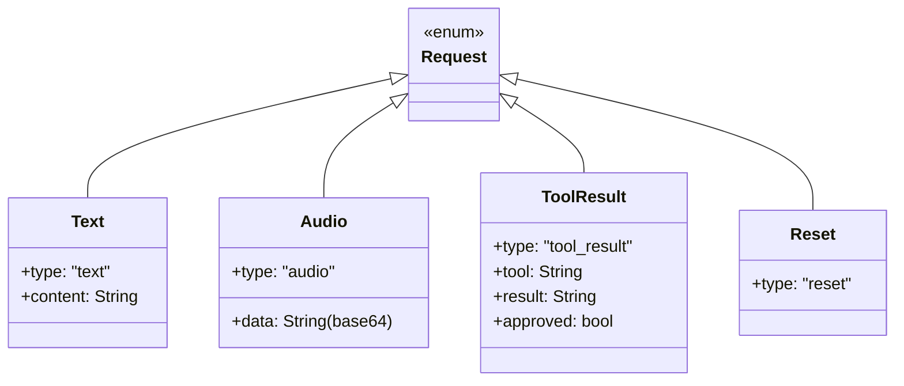
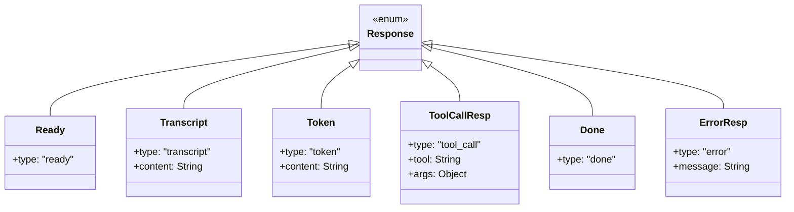
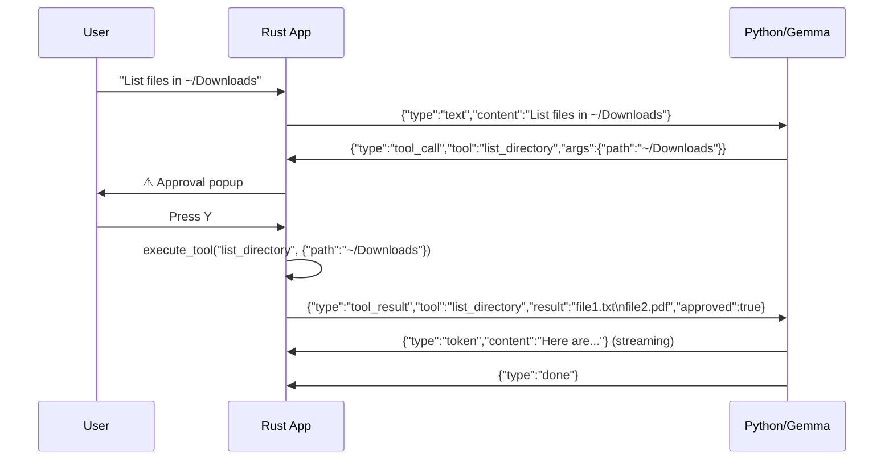

# Interfaces

## Bridge JSON Protocol

The primary interface is the JSON-lines protocol between Rust and Python over stdin/stdout.

### Request Schema (Rust → Python)

### Response Schema (Python → Rust)

## Tool Calling Interface

### Available Tools

| Tool | Parameters | Returns |
|------|-----------|---------|
| `open_file` | `path: String` | Success/failure message |
| `read_file` | `path: String` | File contents (truncated at 2000 chars) |
| `list_directory` | `path: String` | Newline-separated entries (max 50) |
| `run_command` | `command: String` | stdout + stderr (truncated at 2000 chars) |
| `analyze_image` | `path: String`, `question: String` | JSON args passed to Python vision |

### Tool Call Flow

## Audio Interface

- **Format**: PCM 16kHz mono float32
- **Transport**: Base64-encoded 16-bit LE over JSON
- **Max duration**: 28 seconds (enforced by Rust)
- **TTS output**: MMS-TTS generates WAV, played via macOS `afplay`
