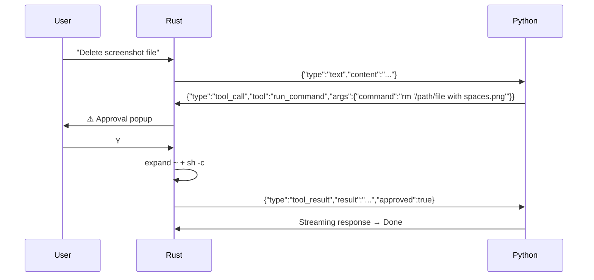

# Interfaces

## Bridge JSON Protocol

Same as before — see [architecture.md](architecture.md) for the full Request/Response tables.

## Tool Calling Interface

| Tool | Parameters | Returns |
|------|-----------|---------|
| `open_file` | `path: String` | Success/failure message |
| `read_file` | `path: String` | File contents (truncated at 2000 chars) |
| `list_directory` | `path: String` | Newline-separated entries (max 50) |
| `run_command` | `command: String` | stdout + stderr (truncated at 2000 chars) |
| `analyze_image` | `path: String`, `question: String` | JSON args passed to Python vision |

### Path Handling
- `~` is expanded to `$HOME` in all file-based tools via `shellexpand()`
- `run_command` expands `~` even inside quotes (`"~/path"` → `"/Users/.../path"`)
- On command failure, result includes: `"HINT: If file paths contain spaces, wrap them in quotes."`
- Tool description tells Gemma: `"CRITICAL: Always use single quotes around file paths that contain spaces"`

### Tool Call Sequence

## Audio Interface

- **Format**: PCM 16kHz mono float32
- **Transport**: Base64-encoded 16-bit LE over JSON
- **Max duration**: 28 seconds
- **TTS output**: MMS-TTS WAV → macOS `afplay`

## Model Selection Interface

- `MODELS` array in `bridge.rs` defines available variants
- `model_status()` in `main.rs` checks: dir exists → `config.json` exists → `.safetensors` files exist
- Partial downloads show `[↓ current/total GB]` via `dir_size()` recursive calculation
- Selected model ID passed to Python via `--model` CLI arg
