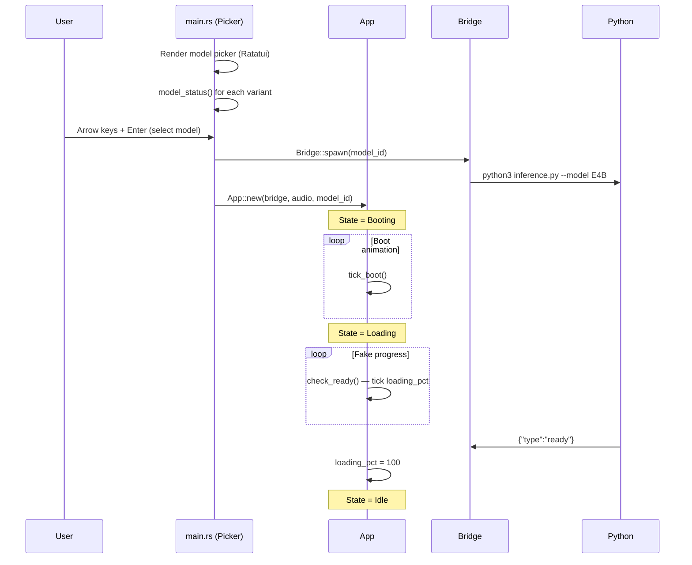
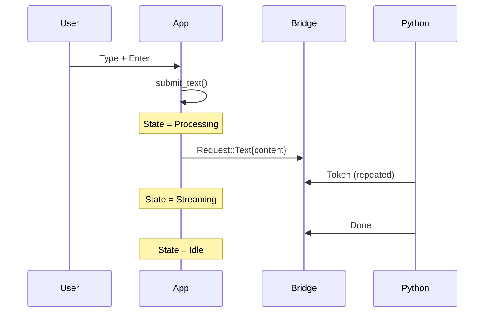
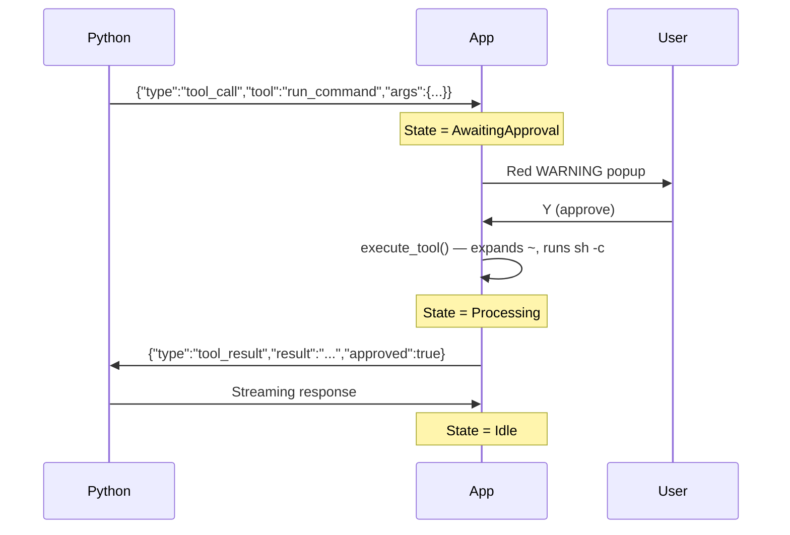
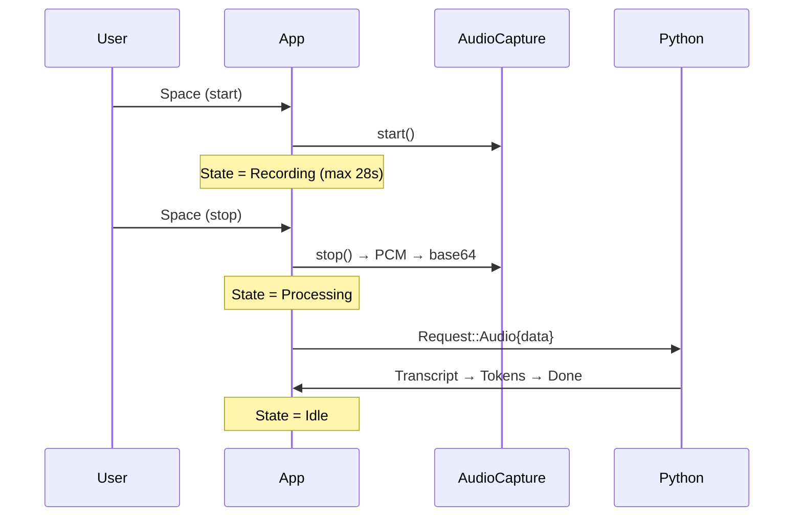
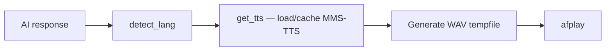

# Workflows

## Startup: Model Selection → Boot → Ready

```mermaid
sequenceDiagram
    participant U as User
    participant M as main.rs (Picker)
    participant App as App
    participant B as Bridge
    participant P as Python

    M->>M: Render model picker (Ratatui)
    M->>M: model_status() for each variant
    U->>M: Arrow keys + Enter (select model)
    M->>B: Bridge::spawn(model_id)
    B->>P: python3 inference.py --model E4B
    M->>App: App::new(bridge, audio, model_id)
    Note over App: State = Booting
    loop Boot animation
        App->>App: tick_boot()
    end
    Note over App: State = Loading
    loop Fake progress
        App->>App: check_ready() — tick loading_pct
    end
    P->>B: {"type":"ready"}
    App->>App: loading_pct = 100
    Note over App: State = Idle
```

## Text Input Flow

```mermaid
sequenceDiagram
    participant U as User
    participant App as App
    participant B as Bridge
    participant P as Python

    U->>App: Type + Enter
    App->>App: submit_text()
    Note over App: State = Processing
    App->>B: Request::Text{content}
    P->>B: Token (repeated)
    Note over App: State = Streaming
    P->>B: Done
    Note over App: State = Idle
```

## Tool Approval Flow

```mermaid
sequenceDiagram
    participant P as Python
    participant App as App
    participant U as User

    P->>App: {"type":"tool_call","tool":"run_command","args":{...}}
    Note over App: State = AwaitingApproval
    App->>U: Red WARNING popup
    U->>App: Y (approve)
    App->>App: execute_tool() — expands ~, runs sh -c
    Note over App: State = Processing
    App->>P: {"type":"tool_result","result":"...","approved":true}
    P->>App: Streaming response
    Note over App: State = Idle
```

## Voice Input Flow

```mermaid
sequenceDiagram
    participant U as User
    participant App as App
    participant Mic as AudioCapture
    participant P as Python

    U->>App: Space (start)
    App->>Mic: start()
    Note over App: State = Recording (max 28s)
    U->>App: Space (stop)
    App->>Mic: stop() → PCM → base64
    Note over App: State = Processing
    App->>P: Request::Audio{data}
    P->>App: Transcript → Tokens → Done
    Note over App: State = Idle
```

## TTS Output (Python-side)

```mermaid
flowchart LR
    A[AI response] --> B[detect_lang]
    B --> C[get_tts — load/cache MMS-TTS]
    C --> D[Generate WAV tempfile]
    D --> E[afplay]
```
