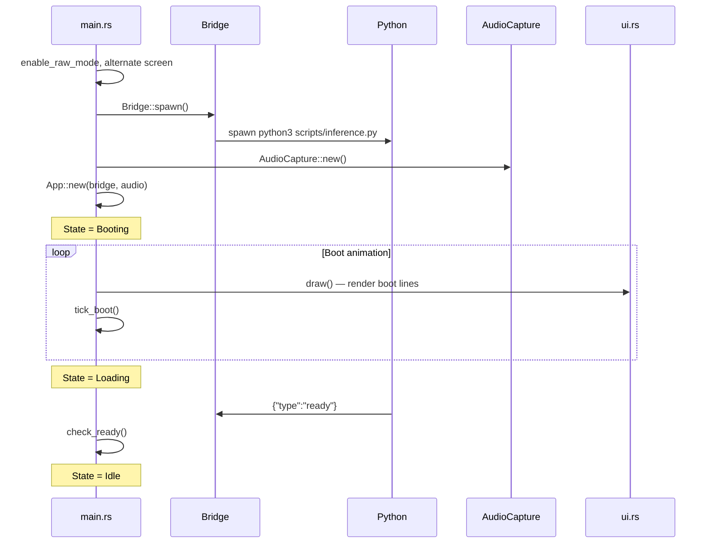
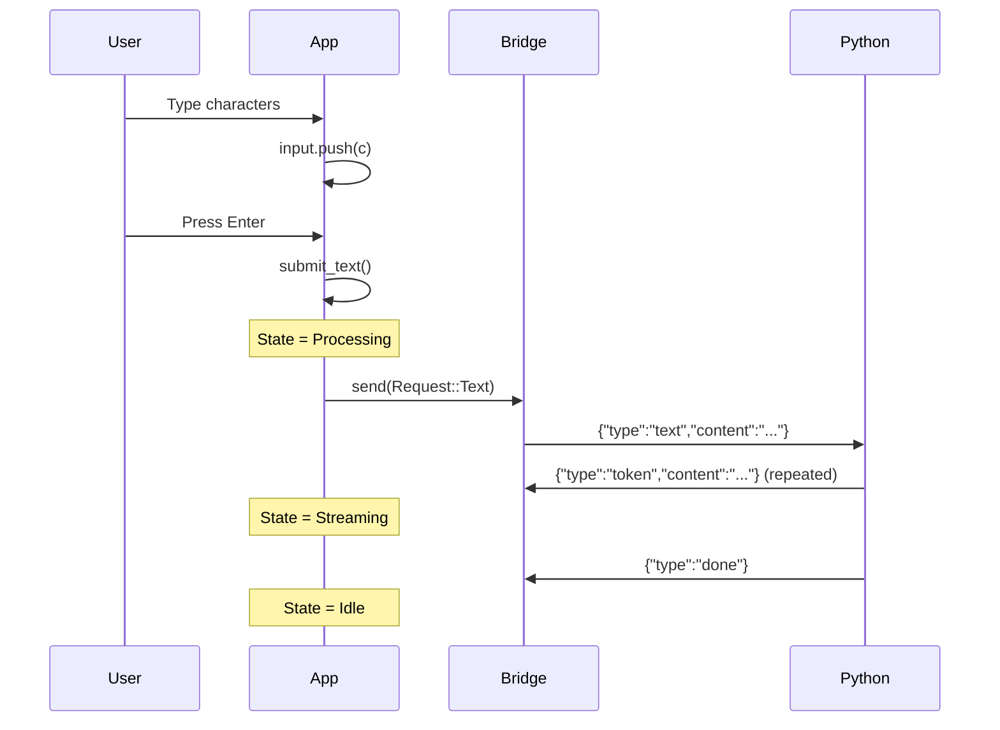
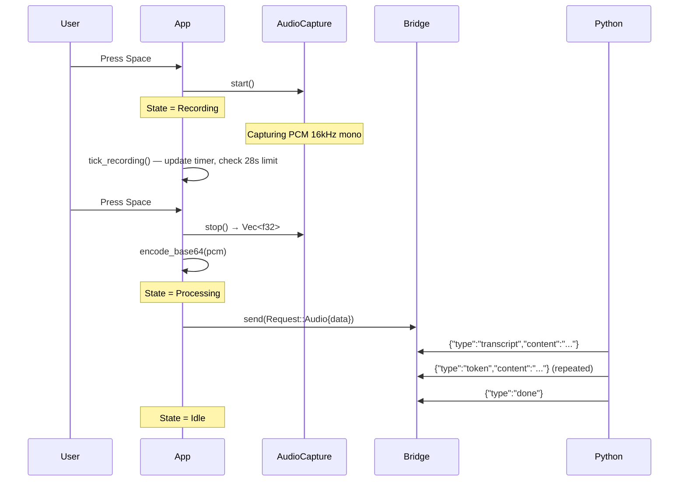
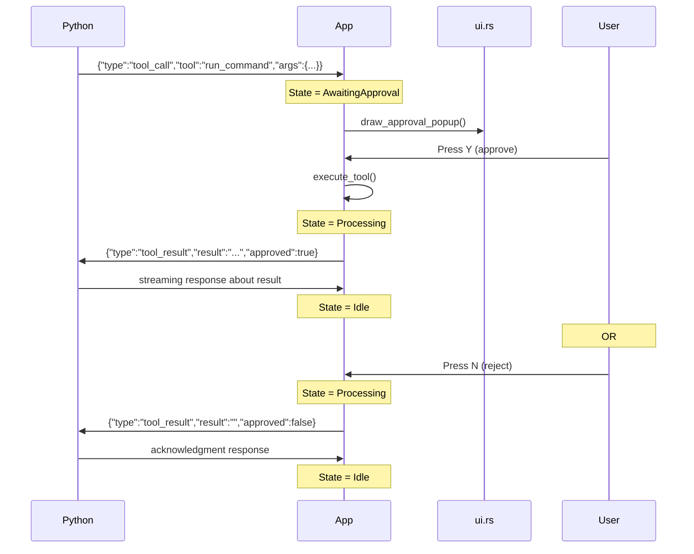
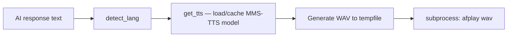

# Workflows

## Application Startup

```mermaid
sequenceDiagram
    participant M as main.rs
    participant B as Bridge
    participant P as Python
    participant A as AudioCapture
    participant UI as ui.rs

    M->>M: enable_raw_mode, alternate screen
    M->>B: Bridge::spawn()
    B->>P: spawn python3 scripts/inference.py
    M->>A: AudioCapture::new()
    M->>M: App::new(bridge, audio)
    Note over M: State = Booting
    loop Boot animation
        M->>UI: draw() — render boot lines
        M->>M: tick_boot()
    end
    Note over M: State = Loading
    P->>B: {"type":"ready"}
    M->>M: check_ready()
    Note over M: State = Idle
```

## Text Input Flow

```mermaid
sequenceDiagram
    participant U as User
    participant App as App
    participant B as Bridge
    participant P as Python

    U->>App: Type characters
    App->>App: input.push(c)
    U->>App: Press Enter
    App->>App: submit_text()
    Note over App: State = Processing
    App->>B: send(Request::Text)
    B->>P: {"type":"text","content":"..."}
    P->>B: {"type":"token","content":"..."} (repeated)
    Note over App: State = Streaming
    P->>B: {"type":"done"}
    Note over App: State = Idle
```

## Voice Input Flow

```mermaid
sequenceDiagram
    participant U as User
    participant App as App
    participant Mic as AudioCapture
    participant B as Bridge
    participant P as Python

    U->>App: Press Space
    App->>Mic: start()
    Note over App: State = Recording
    Note over Mic: Capturing PCM 16kHz mono
    App->>App: tick_recording() — update timer, check 28s limit
    U->>App: Press Space
    App->>Mic: stop() → Vec<f32>
    App->>App: encode_base64(pcm)
    Note over App: State = Processing
    App->>B: send(Request::Audio{data})
    P->>B: {"type":"transcript","content":"..."}
    P->>B: {"type":"token","content":"..."} (repeated)
    P->>B: {"type":"done"}
    Note over App: State = Idle
```

## Tool Approval Flow

```mermaid
sequenceDiagram
    participant P as Python
    participant App as App
    participant UI as ui.rs
    participant U as User

    P->>App: {"type":"tool_call","tool":"run_command","args":{...}}
    Note over App: State = AwaitingApproval
    App->>UI: draw_approval_popup()
    U->>App: Press Y (approve)
    App->>App: execute_tool()
    Note over App: State = Processing
    App->>P: {"type":"tool_result","result":"...","approved":true}
    P->>App: streaming response about result
    Note over App: State = Idle

    Note over U: OR
    U->>App: Press N (reject)
    Note over App: State = Processing
    App->>P: {"type":"tool_result","result":"","approved":false}
    P->>App: acknowledgment response
    Note over App: State = Idle
```

## TTS Output Flow (Python-side)

```mermaid
flowchart LR
    A[AI response text] --> B[detect_lang]
    B --> C[get_tts — load/cache MMS-TTS model]
    C --> D[Generate WAV to tempfile]
    D --> E[subprocess: afplay wav]
```
