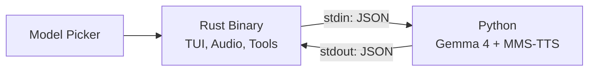

# AGENTS.md — Terminator

> Concise guide for AI agents working on this codebase.

## Architecture

Two-process system: **Rust binary** (TUI + audio + tools) ↔ **Python subprocess** (Gemma 4 inference + TTS). Communication via JSON-lines over stdin/stdout. Supports 4 model variants selected at startup.

## Directory Map

| Path | What It Does |
|------|-------------|
| `src/main.rs` | Entry point — Ratatui model picker, event loop, keyboard dispatch |
| `src/app.rs` | **Core logic** — state machine, tool execution, loading progress bar |
| `src/ui.rs` | TUI rendering — header, chat, input, waveform, approval popup |
| `src/audio.rs` | Mic capture via cpal (16kHz mono PCM), base64 encoding |
| `src/bridge.rs` | `MODELS` array, spawns Python with `--model` arg, JSON-lines protocol |
| `src/theme.rs` | Color palette, boot text templates (`{}` placeholder for model name) |
| `scripts/inference.py` | **AI brain** — `resolve_model()`, text/audio/vision, tool call parsing, TTS |
| `scripts/download_model.py` | Multi-model downloader (E2B/E4B/26B-A4B/31B) |
| `tests/` | `test_bridge.rs` (protocol), `test_audio.rs` (audio pipeline) |
| `docs/` | README translations (12 languages), demo GIF |

## State Machine

`State` enum in `app.rs`:

`Booting → Loading (with progress bar) → Idle → Recording|Processing → Streaming|AwaitingApproval → Idle`

Model selection happens in `main.rs` before the state machine starts.

## Bridge Protocol

### Rust → Python

| `type` | Key Fields | When |
|--------|-----------|------|
| `text` | `content` | User sends text |
| `audio` | `data` (base64 PCM) | User sends voice |
| `tool_result` | `tool`, `result`, `approved` | After tool approval/rejection |
| `reset` | — | Reset conversation |

### Python → Rust

| `type` | Key Fields | When |
|--------|-----------|------|
| `ready` | — | Model loaded |
| `transcript` | `content` | Audio transcribed |
| `token` | `content` | Streaming response token |
| `tool_call` | `tool`, `args` | AI wants to use a tool |
| `done` | — | Response complete |
| `error` | `message` | Something failed |

## Adding a New Model Variant

1. Add entry to `MODELS` in `src/bridge.rs`
2. Add entry to `MODELS` dict in `scripts/download_model.py`
3. Add variant to `resolve_model()` in `scripts/inference.py`
4. Add variant to `model_status()` in `src/main.rs`

## Adding a New Tool

1. Add tool definition to `TOOLS` list in `scripts/inference.py`
2. Add match arm in `execute_tool()` in `src/app.rs`
3. Add display format in `poll_tokens()` `ToolCall` match in `src/app.rs`

## Repo-Specific Patterns

- **Security-by-approval**: Every tool call pauses for user confirmation — never bypass this
- **Truncation limits**: `read_file`/`run_command` results capped at 2000 chars, `list_directory` at 50 entries
- **Shell expansion**: `shellexpand()` in `app.rs` handles `~/` paths. `run_command` also expands `~` inside quotes.
- **TTS playback**: Uses macOS `afplay` — `main.rs` kills lingering `afplay` processes on exit
- **Python venv**: Bridge prefers `.venv/bin/python3`, falls back to system `python3`
- **Model path**: Checks local `models/{variant}` first, falls back to HuggingFace Hub
- **Download detection**: Checks for `config.json` + `.safetensors` files, not just directory existence
- **Boot text templates**: `theme.rs` uses `{}` placeholder replaced by `app.model_display()`

## Custom Instructions
<!-- This section is for human and agent-maintained operational knowledge.
     Add repo-specific conventions, gotchas, and workflow rules here.
     This section is preserved exactly as-is when re-running codebase-summary. -->

### Known Gotchas

- **Spaces in filenames**: Gemma often generates unquoted paths like `rm ~/Downloads/my file.png`. The tool description includes a CRITICAL hint to use single quotes. On failure, the result includes a quoting hint. Despite this, Gemma may still fail — it sometimes takes 2-3 attempts.
- **`~` inside quotes**: Shell doesn't expand `~` inside double quotes. Rust pre-expands `~` in all positions (including inside `"~/..."`) before passing to `sh -c`.
- **Partial downloads show as ready**: Fixed by checking for actual `.safetensors` weight files, not just directory existence. `model_status()` in `main.rs` handles this.
- **Fake progress bar**: `loading_pct` in `app.rs` is cosmetic — it creeps to 92% then stalls until Python sends `ready`. Not tied to actual model loading progress.
- **stderr suppressed**: Python stderr is piped to null in `bridge.rs`. HuggingFace download progress is invisible during runtime. Use `download_model.py` CLI for visible progress.
