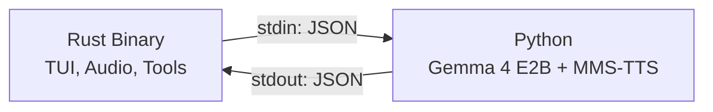

# AGENTS.md — Terminator

> Concise guide for AI agents working on this codebase.

## Architecture

Two-process system: **Rust binary** (TUI + audio + tools) ↔ **Python subprocess** (Gemma 4 E2B inference + TTS). Communication via JSON-lines over stdin/stdout.



## Directory Map

| Path | What It Does |
|------|-------------|
| `src/main.rs` | Entry point — terminal setup, event loop, keyboard dispatch |
| `src/app.rs` | **Core logic** — state machine (`State` enum), tool execution (`execute_tool()`), all app methods |
| `src/ui.rs` | TUI rendering — header, chat, input, waveform, approval popup |
| `src/audio.rs` | Mic capture via cpal (16kHz mono PCM), base64 encoding |
| `src/bridge.rs` | Spawns Python subprocess, JSON-lines protocol, `Request`/`Response` enums |
| `src/theme.rs` | Color palette constants, boot sequence text |
| `scripts/inference.py` | **AI brain** — model loading, text/audio/vision handling, tool call parsing, TTS |
| `scripts/download_model.py` | Downloads Gemma 4 E2B weights to `models/` |
| `tests/` | `test_bridge.rs` (protocol tests), `test_audio.rs` (audio pipeline tests) |
| `docs/` | README translations (12 languages) |

## State Machine

`State` enum in `app.rs` drives all behavior:

`Booting → Loading → Idle → Recording|Processing → Streaming|AwaitingApproval → Idle`

- **AwaitingApproval**: Tool call intercepted, waiting for user Y/N
- **Streaming**: Tokens arriving from Python, displayed in real-time

## Bridge Protocol

### Rust → Python

| `type` | Key Fields | When |
|--------|-----------|------|
| `text` | `content` | User sends text |
| `audio` | `data` (base64 PCM) | User sends voice |
| `tool_result` | `tool`, `result`, `approved` | After tool approval/rejection |
| `reset` | — | Reset conversation |

### Python → Rust

| `type` | Key Fields | When |
|--------|-----------|------|
| `ready` | — | Model loaded |
| `transcript` | `content` | Audio transcribed |
| `token` | `content` | Streaming response token |
| `tool_call` | `tool`, `args` | AI wants to use a tool |
| `done` | — | Response complete |
| `error` | `message` | Something failed |

## Adding a New Tool

1. Add tool definition to `TOOLS` list in `scripts/inference.py`
2. Add match arm in `execute_tool()` in `src/app.rs`
3. Add display format in `poll_tokens()` `ToolCall` match in `src/app.rs`

## Repo-Specific Patterns

- **Security-by-approval**: Every tool call pauses for user confirmation — never bypass this
- **Truncation limits**: `read_file`/`run_command` results capped at 2000 chars, `list_directory` at 50 entries
- **Shell expansion**: `shellexpand()` in `app.rs` handles `~/` paths — use it for any new file-based tools
- **TTS playback**: Uses macOS `afplay` — `main.rs` kills lingering `afplay` processes on exit
- **Python venv**: Bridge prefers `.venv/bin/python3`, falls back to system `python3`
- **Model path**: Checks local `models/gemma-4-E2B-it` first, falls back to HuggingFace Hub download

## Build & Run

```bash
python3 -m venv .venv && source .venv/bin/activate
pip install -r requirements.txt
python3 scripts/download_model.py   # first time only
cargo build --release
./target/release/terminator
```

## Tests

```bash
cargo test
```

Two test files: `test_bridge.rs` (JSON protocol roundtrip) and `test_audio.rs` (PCM encoding).

## Custom Instructions
<!-- This section is for human and agent-maintained operational knowledge.
     Add repo-specific conventions, gotchas, and workflow rules here.
     This section is preserved exactly as-is when re-running codebase-summary. -->
