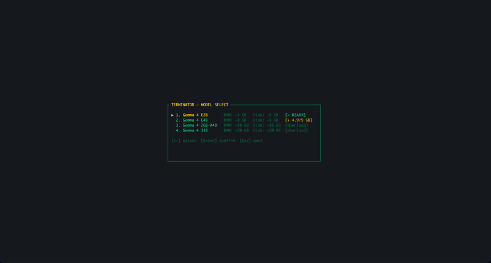

# TERMINATOR 🤖

> *A retro 90s sci-fi terminal AI — talk to a real AI through a retro terminal interface.*
> *Powered by Gemma 4 E2B. 100% offline. Mac native.*

🌍 **README translations:**
[🇹🇭 ไทย](docs/README.th.md) · [🇯🇵 日本語](docs/README.ja.md) · [🇨🇳 中文](docs/README.zh.md) · [🇫🇷 Français](docs/README.fr.md) · [🇪🇸 Español](docs/README.es.md) · [🇰🇷 한국어](docs/README.ko.md) · [🇩🇪 Deutsch](docs/README.de.md) · [🇵🇹 Português](docs/README.pt.md) · [🇷🇺 Русский](docs/README.ru.md) · [🇮🇹 Italiano](docs/README.it.md) · [🇮🇳 हिन्दी](docs/README.hi.md) · [🇸🇦 العربية](docs/README.ar.md)

```
╔══════════════════════════════════════════════════╗
║  TERMINATOR OS v1.0.0                            ║
║  NEURAL CORE: GEMMA-4-E2B .............. ONLINE  ║
║  AUDIO SENSOR: ......................... ACTIVE   ║
║  LANGUAGES: 140+ ....................... READY    ║
╠══════════════════════════════════════════════════╣
║                                                  ║
║  > Hello, human. I am ready for your input.      ║
║                                                  ║
║  [SPACE] speak  [ENTER] send  [ESC] quit         ║
╚══════════════════════════════════════════════════╝
```

## Features

- 🧠 **Gemma 4 E2B** — multimodal AI brain (text + audio + vision), 140+ languages
- 🎤 **Voice input** — push-to-talk with live oscilloscope waveform
- 🔊 **Voice output** — MMS-TTS multilingual speech synthesis (English, Thai, etc.)
- 👁️ **Vision** — analyze images on your filesystem via Gemma's vision encoder
- 🔧 **Agentic tools** — open files, read files, list directories, run commands
- ⚠️ **Security approval** — every tool action requires explicit user approval via popup
- 🖥️ **Retro terminal UI** — neon green terminal with boot sequence, powered by Ratatui
- 🔒 **100% offline** — no cloud, no API keys, no data leaves your machine
- 🍎 **Mac native** — optimized for Apple Silicon (M1+)

## Demo



## Architecture

```
terminator (Rust binary)
├── ratatui       → retro CRT terminal UI
├── cpal          → microphone capture (PCM 16kHz mono)
└── Python bridge (subprocess, JSON protocol)
    ├── HuggingFace Transformers
    │   └── Gemma 4 E2B (text + audio + vision, 1 model)
    └── MMS-TTS (facebook/mms-tts-eng, mms-tts-tha, etc.)
```

### Data Flow

```
🎤 Voice → cpal → Gemma 4 (transcribe) → Gemma 4 (think/tools) → MMS-TTS 🔊
⌨️ Text  →                                Gemma 4 (think/tools) → MMS-TTS 🔊
                                              ↓
                                    [tool call detected]
                                              ↓
                                    ⚠ WARNING popup [Y/N]
                                              ↓
                                    Execute (open/read/list/run/vision)
                                              ↓
                                    Result → Gemma 4 → response
```

## Requirements

- macOS on Apple Silicon (M1+)
- Rust 1.75+
- Python 3.11+
- Disk & RAM depend on model (see below)

## Models

| Model | Role | Disk | RAM | Context | Best For |
|-------|------|------|-----|---------|----------|
| [Gemma 4 E2B](https://huggingface.co/google/gemma-4-E2B-it) | Brain (text + audio + vision) | ~5 GB | ~4 GB | 128K | Edge / phones |
| [Gemma 4 E4B](https://huggingface.co/google/gemma-4-E4B-it) | Brain (text + audio + vision) | ~9 GB | ~8 GB | 128K | Laptops |
| [Gemma 4 26B-A4B](https://huggingface.co/google/gemma-4-26B-A4B-it) | Brain (text + audio + vision, MoE) | ~16 GB | ~18 GB | 256K | Best balance |
| [Gemma 4 31B](https://huggingface.co/google/gemma-4-31B-it) | Brain (text + audio + vision, Dense) | ~20 GB | ~20 GB | 256K | Max quality |
| [MMS-TTS](https://huggingface.co/facebook/mms-tts-eng) | Voice output | ~145 MB/lang | — | — | 1100+ languages |

At startup, a model picker lets you choose which variant to run. Downloaded models show `[✓ READY]`.

## Quick Start

```bash
# 1. Clone
git clone https://github.com/zixma13/terminator.git
cd terminator

# 2. Install Python dependencies
python3 -m venv .venv
source .venv/bin/activate
pip install -r requirements.txt

# 3. Download model (first run only, ~5GB)
python3 scripts/download_model.py

# 4. Build & run
cargo build --release
./target/release/terminator
```

## Controls

| Key       | Action                              |
|-----------|-------------------------------------|
| `Enter`   | Send typed message                  |
| `Tab`     | Toggle voice/text mode              |
| `Space`   | Tap to start/stop recording (voice) |
| `Y`       | Approve tool action                 |
| `N`       | Reject tool action                  |
| `Esc`     | Quit                                |

## Tools (Agentic)

TERMINATOR can interact with your system via tool calling. Every action requires explicit approval through a WARNING popup.

| Tool             | Description                          |
|------------------|--------------------------------------|
| `open_file`      | Open file/folder in default app      |
| `read_file`      | Read and return text file contents   |
| `list_directory` | List files in a directory            |
| `run_command`    | Execute a shell command              |
| `analyze_image`  | Analyze image using Gemma 4 vision   |

Example: *"List files in my Downloads"* → approval popup → executes `ls` → AI summarizes results.

## Project Structure

```
terminator/
├── Cargo.toml              # Rust dependencies
├── requirements.txt        # Python dependencies
├── src/
│   ├── main.rs             # Entry point, event loop
│   ├── app.rs              # State machine, tool execution
│   ├── ui.rs               # Ratatui TUI rendering, approval popup
│   ├── audio.rs            # Mic capture via cpal, resampling
│   ├── bridge.rs           # Python subprocess bridge (JSON protocol)
│   └── theme.rs            # CRT/neon visual theme
├── scripts/
│   ├── download_model.py   # Model downloader
│   └── inference.py        # Gemma 4 inference + function calling + TTS
├── tests/
│   ├── test_bridge.rs      # Bridge protocol tests
│   └── test_audio.rs       # Audio pipeline tests
└── docs/
    └── SDLC.md             # Full SDLC documentation
```

## Resource Usage

Measured on Apple M5 Pro (48GB):

| Component        | CPU     | RAM      |
|------------------|---------|----------|
| Rust TUI         | < 1%    | ~22 MB   |
| Python/Gemma 4   | ~78%*   | ~4.2 GB  |
| MMS-TTS          | burst   | ~145 MB  |
| **Total**        |         | **~4.3 GB** |

*\*CPU spikes during inference only, idle otherwise. GPU (Metal) used for acceleration.*

## Models

| Model | Role | Size | Languages |
|-------|------|------|-----------|
| [Gemma 4 E2B](https://huggingface.co/google/gemma-4-E2B-it) | Brain (text + audio + vision) | ~5 GB | 140+ |
| [MMS-TTS](https://huggingface.co/facebook/mms-tts-eng) | Voice output | ~145 MB/lang | 1100+ |

## License

Apache 2.0
